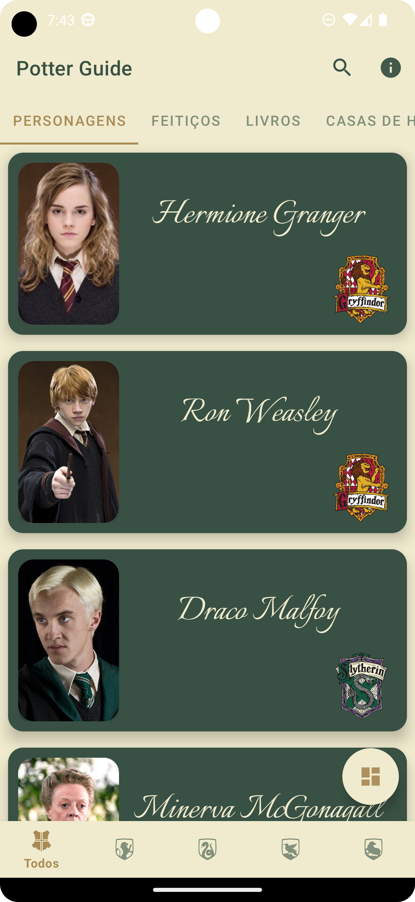
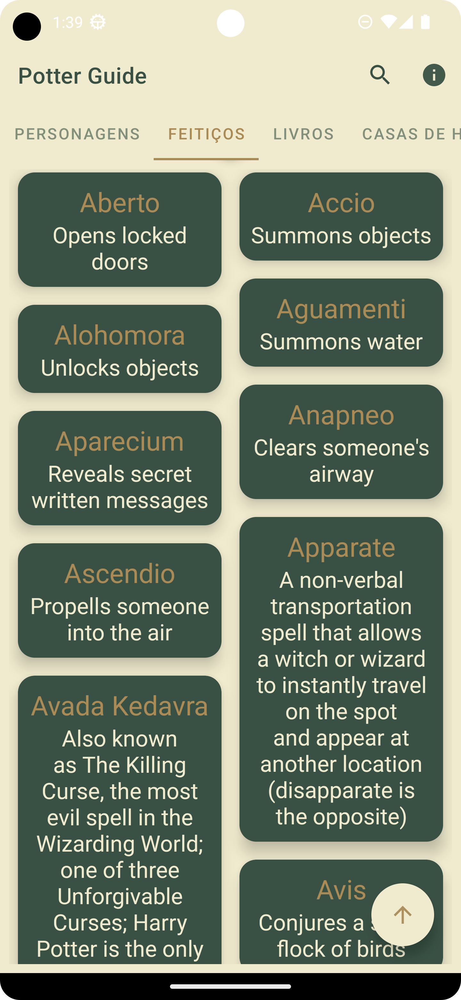
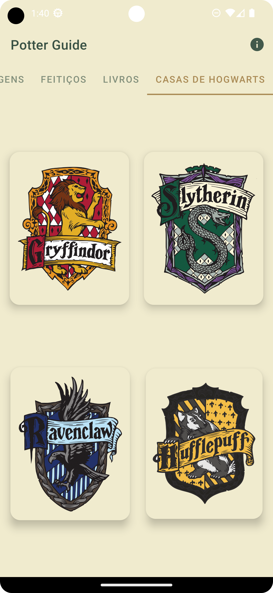
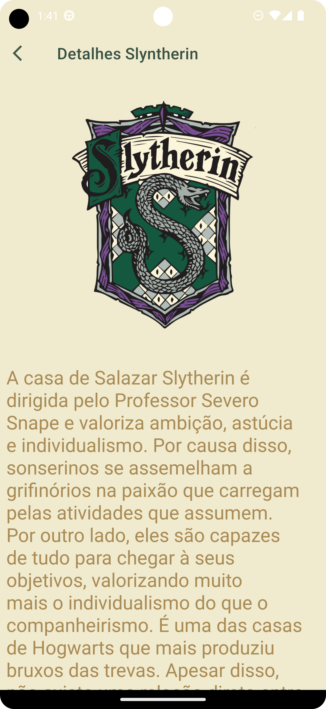
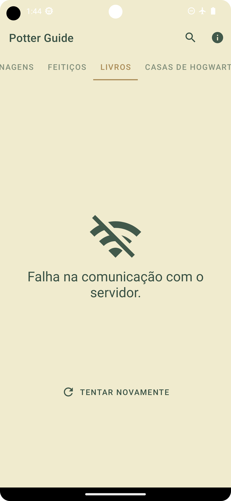
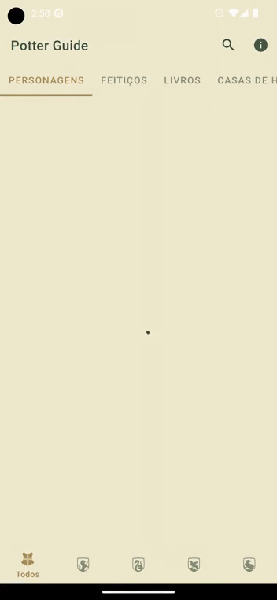
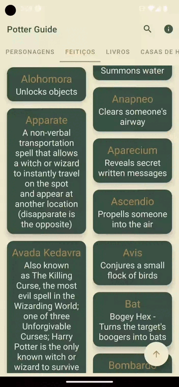
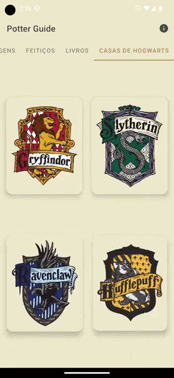
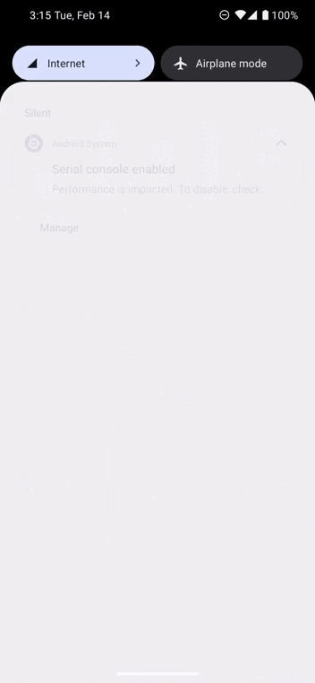

# PotterGuide<h1 align="center">Potter Guide</h1>

<p align="center">
   <a href="https://opensource.org/licenses/Apache-2.0"></a>
   <a href="https://android-arsenal.com/api?level=27"></a>
  <br>
  <a href="https://wa.me/+5532998002817"></a>
  <a href="https://www.linkedin.com/in/leonardotissi/"></a>
  <a href="mailto:leonardo.tissi.si@gmail.com"></a>
</p>

<p align="center">  

⭐ Esse é um projeto para demonstrar meu conhecimento técnico no desenvolvimento Android nativo com Kotlin. Mais informações técnicas abaixo.

Aplicativo capaz de realizar consultas de livros e personagens da série Harry Potter com arquitetura MVVM.
Nesse aplicativo utilizei Retrofit para consulta das apis: HP Api e Google Books; Koin para injeção de dependência; Viewmodel e outros componentes do jetpack; Utilização de DiffUtils para otimização das recyclersViews; Coil para carregar as imagens a partir da URL; Intent extra para envio de informações entre activitys; View binding, coroutines, lifecycle, tab layout, view pager, fragments, bottom sheet dialog, SwipeRefresh layout, SearchView, SnackBar, Constraint Layout, Alert Dialog e alguns outros componentes do Material Design. Esse aplicativo está sempre em aprimoramento, pois o utilizo para colocar em prática alguns conhecimentos adquiridos.

</p>

</br>

<p float="left" align="center">












</p>


Faça o download da <a href="arquivos_Readme/app-release.apk?raw=true">APK diretamente</a>. Você pode ver <a href="https://www.google.com/search?q=como+instalar+um+apk+no+android">aqui</a> como instalar uma APK no seu aparelho android.

## Tecnologias usadas e bibliotecas de código aberto

- Minimum SDK level 27
- [Linguagem Kotlin](https://kotlinlang.org/)

- Jetpack - LISTE O MÁXIMO DE COMPONENTES DO JETPACK QUE VOCÊ USA
  - Lifecycle: Observe os ciclos de vida do Android e manipule os estados da interface do usuário após as alterações do ciclo de vida.
  - ViewModel: Gerencia o detentor de dados relacionados à interface do usuário e o ciclo de vida. Permite que os dados sobrevivam a alterações de configuração, como rotações de tela.
  - ViewBinding: Liga os componentes do XML no Kotlin através de uma classe que garante segurança de tipo e outras vantagens.
  - Custom Views: View customizadas feitas do zero usando XML.
  - LifecycleScope: Para execuções em coroutine.
  - DataStore: Utilizado para armazenamento de dados em cache.

 

- Arquitetura
  - MVVM (View - ViewModel - Model)
  - Comunicação da ViewModel com a View através de LiveData
  - Repositórios para comunicação entre o viewModel e o Retrofit
  
- Bibliotecas - LISTE TODAS AS BIBLIOTECAS USADAS NO PROJETO, COM LINK E DESCRIÇÃO BREVE DO QUE ELA FAZ
  - [Retrofit2](https://github.com/square/retrofit): Para realizar requisições seguindo o padrão HTTP.
  - [Koin](https://insert-koin.io/): Para Injeção de dependência
  - [Coil](https://github.com/coil-kt/coil): Para load de imagens a partir da URL.
  - [swipeRefreshLayout](https://developer.android.com/jetpack/androidx/releases/swiperefreshlayout?hl=pt-br): Para comportamento de load comum em aplicativos.
 

## Arquitetura
APRESENTE A ARQUITETURA UTILIZADA NO PROJETO
**Potter Guide** utiliza a arquitetura MVVM e o padrão de Repositories, que segue as [recomendações oficiais do Google](https://developer.android.com/topic/architecture).
</br></br>
ADICIONE UM FLUXOGRAMA DA ARQUITETURA UTILIZADA - https://excalidraw.com/
<br>

## API de terceiros

- [HP-API](https://hp-api.onrender.com/): Consulta de Personagens e feitiços da série Harry Potter.
- [Google Books API](https://developers.google.com/books?hl=pt-br): Consulta de livros com filtro para Livros da série Harry Potter.

## Features

<div align="center" style=" width: 100%;  justify-content: space-between;">
  











</div>


# Licença

COLOQUE A LICENÇA - https://opensource.org/licenses

```xml

```
