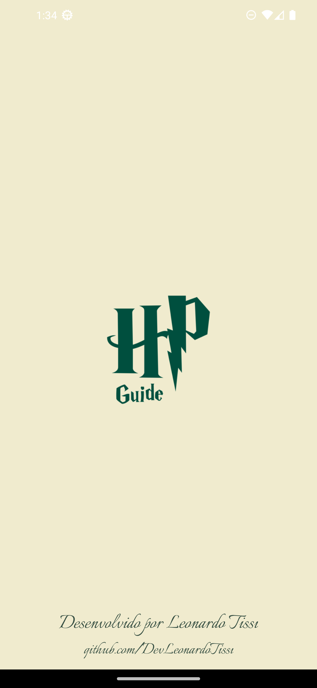
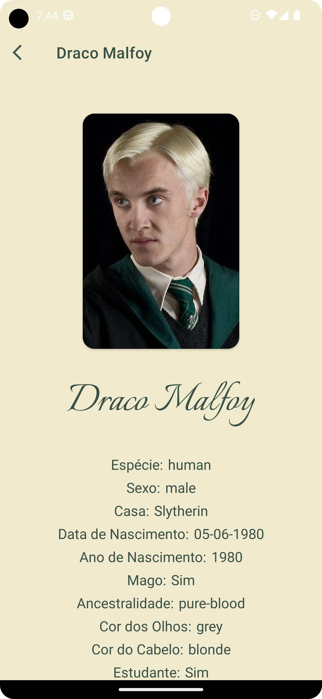
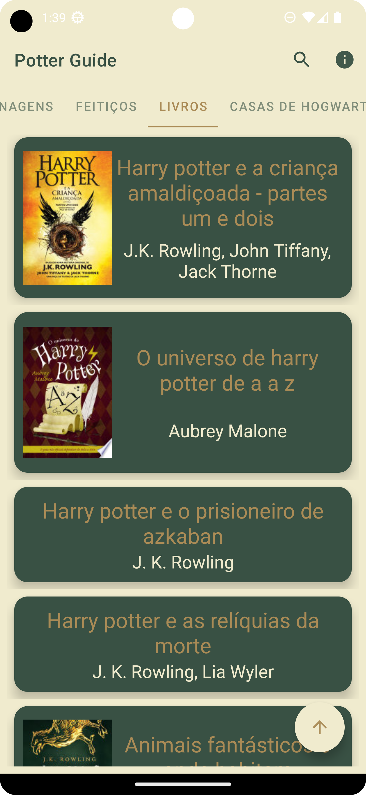
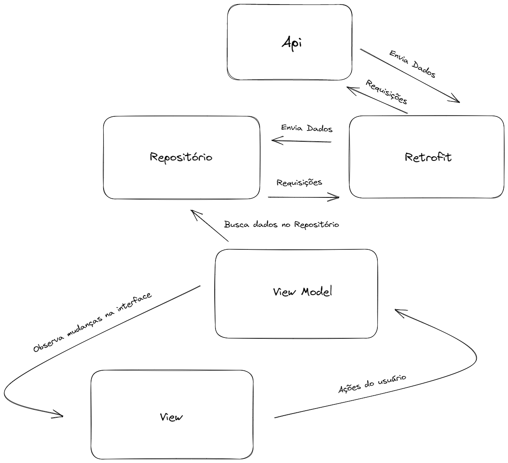
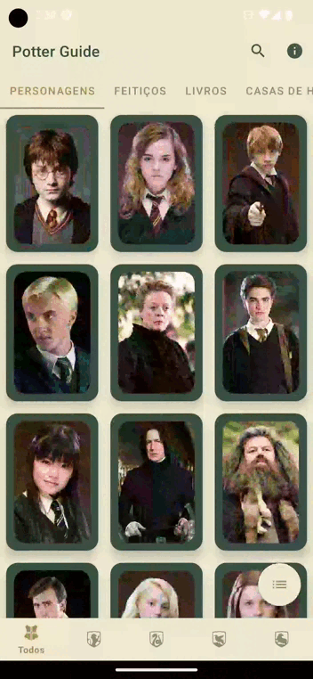
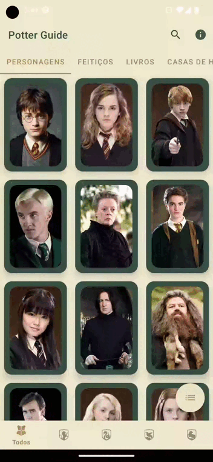

# PotterGuide<h1 align="center">Potter Guide</h1>

<p align="center">
   <a href="https://opensource.org/licenses/Apache-2.0"></a>
   <a href="https://android-arsenal.com/api?level=27"></a>
  <br>
  <a href="https://wa.me/+5532998002817"></a>
  <a href="https://www.linkedin.com/in/leonardotissi/"></a>
  <a href="mailto:leonardo.tissi.si@gmail.com"></a>
</p>

<p align="center">  

⭐ Esse é um projeto para demonstrar meu conhecimento técnico no desenvolvimento Android nativo com Kotlin. Mais informações técnicas abaixo.

Aplicativo capaz de realizar consultas de livros e personagens da série Harry Potter com arquitetura MVVM.
Nesse aplicativo utilizei Retrofit para consulta das apis: HP Api e Google Books; Koin para injeção de dependência; Viewmodel e outros componentes do jetpack; Utilização de DiffUtils para otimização das recyclersViews; Coil para carregar as imagens a partir da URL; Intent extra para envio de informações entre activitys; View binding, coroutines, adição de menus, lifecycle, tab layout, view pager, fragments, bottom sheet dialog, SwipeRefresh layout, SearchView, SnackBar, Constraint Layout, Alert Dialog e alguns outros componentes do Material Design. Esse aplicativo está sempre em aprimoramento, pois o utilizo para colocar em prática alguns conhecimentos adquiridos.

</p>

</br>

<p float="left" align="center">








</p>


Faça o download da <a href="app/release/app-release.apk?raw=true">APK diretamente</a>. Você pode ver <a href="https://www.google.com/search?q=como+instalar+um+apk+no+android">aqui</a> como instalar uma APK no seu aparelho android.

## Tecnologias usadas e bibliotecas de código aberto

- Minimum SDK level 27
- [Linguagem Kotlin](https://kotlinlang.org/)

- Jetpack
  - Lifecycle: Observe os ciclos de vida do Android e manipule os estados da interface do usuário após as alterações do ciclo de vida.
  - ViewModel: Gerencia o detentor de dados relacionados à interface do usuário e o ciclo de vida. Permite que os dados sobrevivam a alterações de configuração, como rotações de tela.
  - ViewBinding: Liga os componentes do XML no Kotlin através de uma classe que garante segurança de tipo e outras vantagens.
  - Custom Views: View customizadas feitas do zero usando XML.
  - LifecycleScope: Para execuções em coroutine.
  - DataStore: Armazenamento de dados em cache.

 
- Arquitetura
  - MVVM (View - ViewModel - Model)
  - Comunicação da ViewModel com a View através de LiveData
  - Repositórios para comunicação entre o viewModel e o Retrofit
  

- Bibliotecas
  - [Retrofit2:](https://github.com/square/retrofit) Para realizar requisições seguindo o padrão HTTP.
  - [Koin:](https://insert-koin.io/) Para Injeção de dependência
  - [Coil:](https://github.com/coil-kt/coil) Para load de imagens a partir da URL.
  - [SwipeRefreshLayout:](https://developer.android.com/jetpack/androidx/releases/swiperefreshlayout?hl=pt-br) Para comportamento de load comum em aplicativos.
 

## Arquitetura

**Potter Guide** utiliza a arquitetura MVVM e o padrão de Repositories, que segue as [recomendações oficiais do Google](https://developer.android.com/topic/architecture).
</br></br>

<div align="center" style=" width: 100%; background-color: white; ">

</div>
<br>

## API de terceiros

- [HP-API:](https://hp-api.onrender.com/)  Consulta de Personagens e feitiços da série Harry Potter.
- [Google Books API:](https://developers.google.com/books?hl=pt-br) Consulta de livros com filtro para Livros da série Harry Potter.

## Features
### SplashScreen (verificação com conexão);
### ViewPager e tabLayout para navegação entre fragments;
### Bottom Navigation para filtros de Busca;
### Floating Action Button para Retornar para o início da lista (visível apenas quando o usuário realiza o scroll);
### Floating Action Button para alterar o tipo de visualização da recycler view (A opção escolhida fica salva em memória através do DataStore);
### Menus nos fragments com mecanismos de busca com SearchView;
### AlerDialog;
### Tratamentos para possíveis erros de comunicação com o servidor ou com a Internet

<br>

<div align="center" style=" width: 100%; display: inline-block;  justify-content: space-between;">
  








</div>


# Licença

```xml
Copyright [2023] [Leonardo Tissi]

Licensed under the Apache License, Version 2.0 (the "License");
you may not use this file except in compliance with the License.
You may obtain a copy of the License at

  http://www.apache.org/licenses/LICENSE-2.0

Unless required by applicable law or agreed to in writing, software
distributed under the License is distributed on an "AS IS" BASIS,
WITHOUT WARRANTIES OR CONDITIONS OF ANY KIND, either express or implied.
See the License for the specific language governing permissions and
limitations under the License.
```
